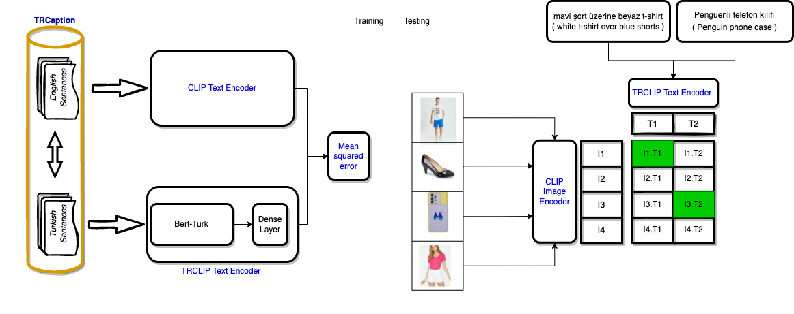
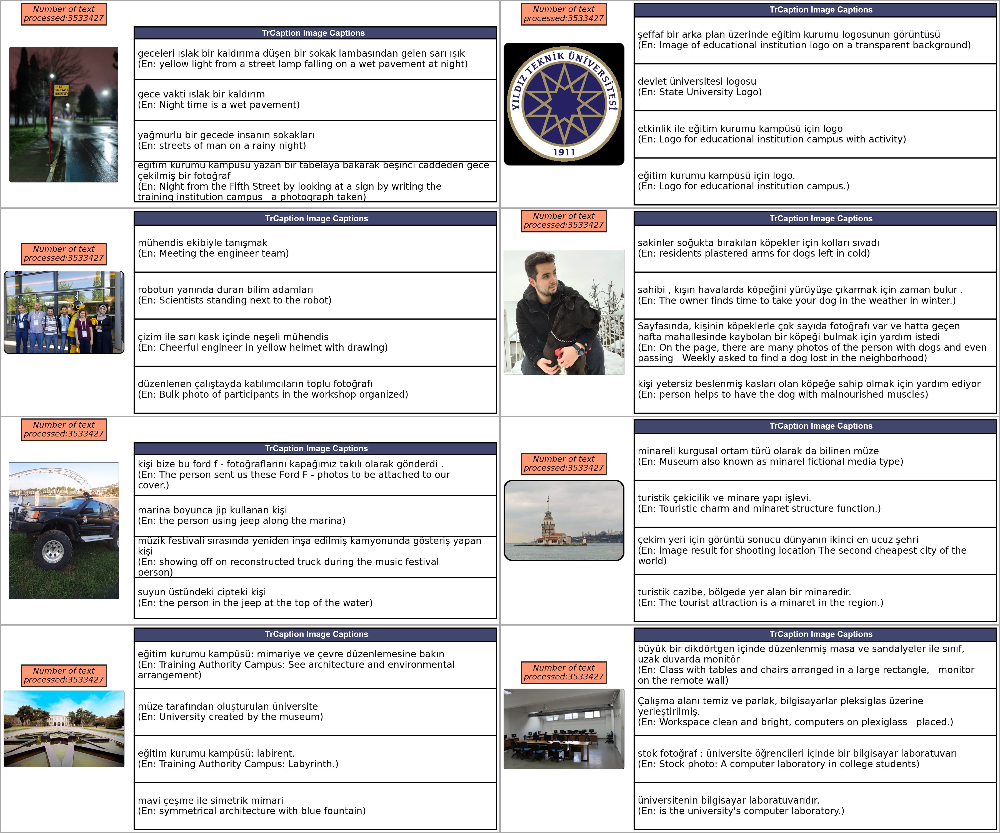
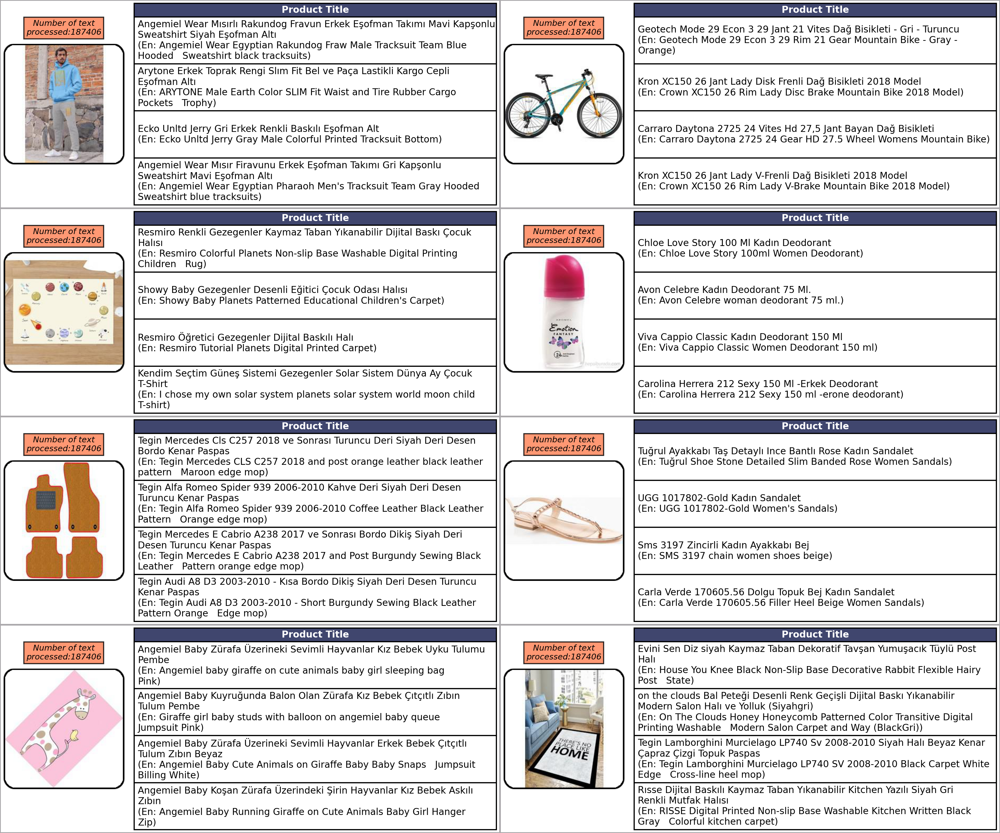
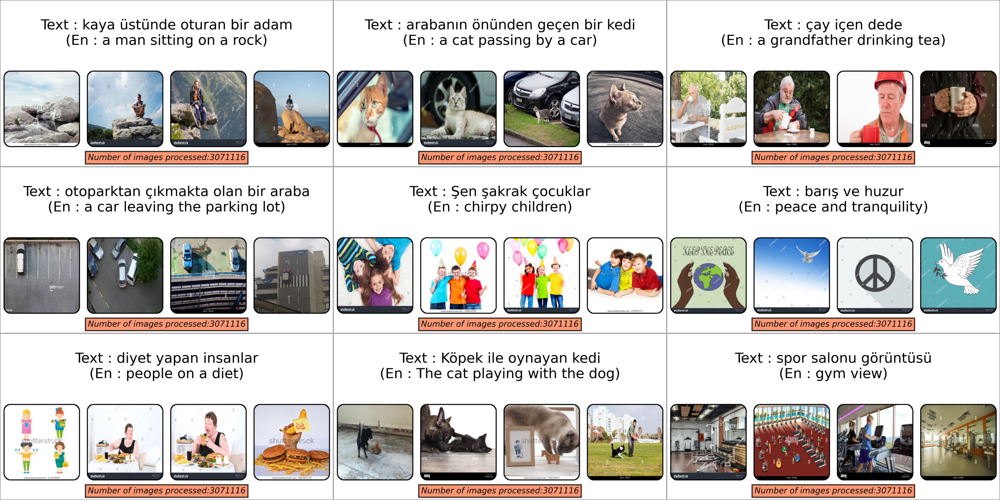

<!-- Improved compatibility of back to top link: See: https://github.com/othneildrew/Best-README-Template/pull/73 -->

<!--
*** Thanks for checking out the Best-README-Template. If you have a suggestion
*** that would make this better, please fork the repo and create a pull request
*** or simply open an issue with the tag "enhancement".
*** Don't forget to give the project a star!
*** Thanks again! Now go create something AMAZING! :D
-->

<!-- PROJECT SHIELDS -->
<!--
*** I'm using markdown "reference style" links for readability.
*** Reference links are enclosed in brackets [ ] instead of parentheses ( ).
*** See the bottom of this document for the declaration of the reference variables
*** for contributors-url, forks-url, etc. This is an optional, concise syntax you may use.
*** https://www.markdownguide.org/basic-syntax/#reference-style-links
-->

<!-- PROJECT LOGO -->
 

  

<h3 align="center">A General Purpose Turkish CLIP Model (TrCLIP) for Image&Text Retrieval and its Application to E-Commerce</h3>

  

    A turkish supported CLIP
     
    <a href="https://huggingface.co/spaces/yusufani/TrCLIP"><strong>View SPACES Demo</strong></a>
     
     
    <a href="https://github.com/github_username/repo_name">Paper(will be added)</a>
    ·
    <a href="https://github.com/github_username/repo_name/issues">Report Bug</a>
    ·
    <a href="https://github.com/github_username/repo_name/issues">Request Feature</a>
  

<!-- ABOUT THE PROJECT -->
## About The Project

In this paper, we introduce a Turkish adaption of CLIP (Contrastive Language-Image Pre-Training). Our approach is to train a model with the same output space as the Text encoder of the CLIP model while processing Turkish input. For this, we collected 2.5M unique English-Turkish data. The model we named TrCLIP performed  71\% in CIFAR100, 86\% in VOC2007, and 47\%  in FER2013 as zero-shot accuracy. We have examined its performance on e-commerce data and a vast domain-independent dataset in image and text retrieval tasks. The model can work in Turkish without any extra fine-tuning.

(<a href="#readme-top">back to top</a>)

### Prerequisites

See requirements.txt

### Installation

    ! pip install trclip

<!-- USAGE EXAMPLES -->

Model can be found in huggingface : https://huggingface.co/yusufani/trclip-vitl14-e10

TrCaption Dataset link : https://drive.google.com/file/d/1-QrfiwPFvzhh8mWW4Bc0uKHRC8OWaRGa/view?usp=sharing

Trcaption pre-calculated features : Ofcourse you can create embeddings from strcatch but it takes time:D
Trcaption metadata : https://drive.google.com/file/d/1-LlI104fo3KgKHjnoYZpo51aqiH4dS8f/view?usp=sharing
Trcaption images - trclip-vitl14-e10 : https://drive.google.com/file/d/1-JBSLX3OZ5aCSGJEUxJm680BZCuRweFj/view?usp=sharing
Trcaption texts - trclip-vitl14-e10 : will added

## Usage
    trclip = Trclip(model_path, clip_model='ViT-L/14', device='cpu')
    images = [Image.open() for i in image_paths]
    texts = ['kedi', 'köpek' , 'at']

Mode image_retrieval -> It calculates probabilities for each text, basically if you want to fetch image for given text

Mode text_retrieval -> It calculates probabilities for each image, basically if you want to fetch text for given image

     per_mode_indices, per_mode_probs = trclip.get_results(texts=texts, images=ims, mode='image_retrieval')

#### Pre calculating features ( Optional )
    image_features= trlip.get_image_features(images)
    text_features= trlip.get_text_features(texts)
    per_mode_indices, per_mode_probs = trclip.get_results(text_features=text_features, image_features=image_features, mode='image_retrieval')

## Visualizing results
#### Image retrieval visualize
    from trclip.visualizer import image_retrieval_visualize,

    image_retrieval_visualize(per_mode_indices, per_mode_probs, texts, im_paths,
                                         n_figure_in_column=2,
                                         n_images_in_figure=4, n_figure_in_row=1, save_fig=False,
                                         show=False,
                                         break_on_index=-1)
#### Text Retrieval visualize
    from trclip.visualizer import text_retrieval_visualize,
    text_retrieval_visualize(per_mode_indices, per_mode_probs, im_paths, texts,
                                    n_figure_in_column=4,
                                    n_texts_in_figure=4 if len(texts) > 4 else len(texts),
                                    n_figure_in_row=2,
                                    save_fig=False,
                                    show=False,
                                    break_on_index=-1,
                                    )

<!-- Example outputs -->
## Text retrieval

## Image retrieval

<!-- LICENSE -->
## License

Distributed under the MIT License. See `LICENSE.txt` for more information.

(<a href="#readme-top">back to top</a>)

<!-- CONTACT -->
## Contact

Your Name - yusufani8@gmail.com

Project Link: [https://github.com/yusufani/TrCLIP](https://github.com/yusufani/TrCLIP)

(<a href="#readme-top">back to top</a>)

(<a href="#readme-top">back to top</a>)

<!-- MARKDOWN LINKS & IMAGES -->
<!-- https://www.markdownguide.org/basic-syntax/#reference-style-links -->
[contributors-shield]: https://img.shields.io/github/contributors/github_username/repo_name.svg?style=for-the-badge
[contributors-url]: https://github.com/github_username/repo_name/graphs/contributors
[forks-shield]: https://img.shields.io/github/forks/github_username/repo_name.svg?style=for-the-badge
[forks-url]: https://github.com/github_username/repo_name/network/members
[stars-shield]: https://img.shields.io/github/stars/github_username/repo_name.svg?style=for-the-badge
[stars-url]: https://github.com/github_username/repo_name/stargazers
[issues-shield]: https://img.shields.io/github/issues/github_username/repo_name.svg?style=for-the-badge
[issues-url]: https://github.com/github_username/repo_name/issues
[license-shield]: https://img.shields.io/github/license/github_username/repo_name.svg?style=for-the-badge
[license-url]: https://github.com/github_username/repo_name/blob/master/LICENSE.txt
[linkedin-shield]: https://img.shields.io/badge/-LinkedIn-black.svg?style=for-the-badge&logo=linkedin&colorB=555
[linkedin-url]: https://linkedin.com/in/yusufani
[product-screenshot]: images/screenshot.png
